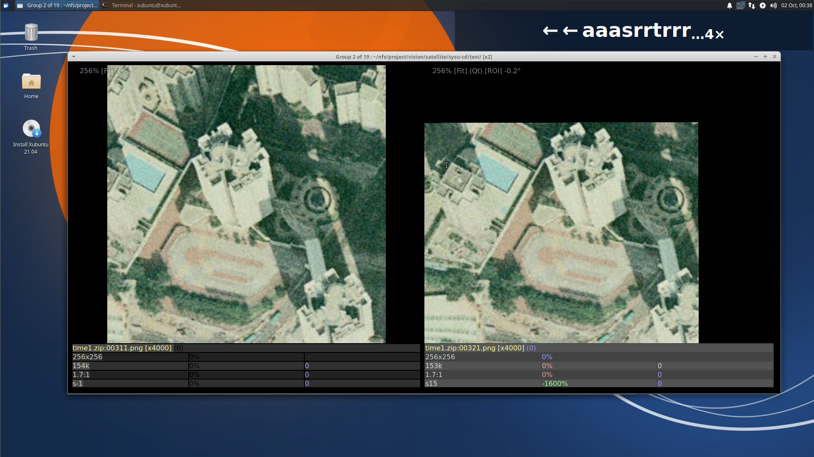

About cbird
=========================
cbird is a command-line program for finding duplicate images and videos that cannot be found by general methods such as file hashing. Content-Based Image Recognition (CBIR) is used, which examines the pixels of files to get comparable features and "perceptual" hash codes.

The main features are:

- Image and video search
- Cached search index
- GUI for evaluating duplicates
- Huge index/database is possible
- Comprehensive file format support
- Search inside zip files
- Hardware video decoding including multiple decoders/gpus

Installing
=========================

### Compile

Compile it yourself using [my detailed notes](doc/cbird-compile.md).

### Download

[Download binaries on Github](https://github.com/scrubbbbs/cbird/releases)

#### Linux AppImage

Add execute permission and run
```shell
chmod +x cbird-0.8.0-x86_64.AppImage
./cbird-0.8.0-x86_64.AppImage -install # optional install helper
cbird [...]
```
- Required packages: trash-cli
- Optional packages: ocenaudio, kdenlive

##### AppImage Issues
- AppImage won't run (debian, Ubuntu, etc)
  + `apt install libfuse2`
- Missing libOpenGL.so.0
  + debian: `apt install libopengl0`
  + redhat: `yum install libglvnd-opengl`
- Missing window titlebar (Fedora)
  + `cbird -platform wayland-egl [...]` 

#### Mac OS X 11.0+ x86

- Unzip the distribution file and run

`cbird/cbird-mac [...]`


#### Windows 10+
- Unzip the distribution file and run the program
- Install helpers (optional): vlc, kdenlive

##### Windows PowerShell
Optional: create shortcuts for cbird

- Unzip into C:\ so you have C:\cbird\cbird.exe
- Enable script execution
  + Run PowerShell as administrator
  + Enter ``Set-Execution-Policy RemoteSigned``
  + Close PowerShell
- Create profile script (if you don't have one)
  + Run PowerShell normally
  + ``New-Item -Type File $PROFILE -Force``
- Add cbird shortcut to profile
  + `OpenWith $PROFILE`
  + `Set-Alias -Name cbird -Value C:\cbird\cbird.exe`
- Shortcut for pictures folder
  + `function cbird-pics {cbird -use $HOME\Pictures $args}`

Getting Started
========================

#### Get Help

- `cbird -help` is very detailed, copied [here](https://gist.github.com/scrubbbbs/c7177a0a97e098c6bb10ae4afe8f6c35) for your convenience
- [github wiki](https://github.com/scrubbbbs/cbird/wiki) has more details
- some commands that take a value will also accept "help" to get more info, e.g. `-i.algos help`
- `-list-*` commands give more info about settings/configuration


#### Index the files in `<path>`, caching into `<path>/_index`
`cbird -use <path> -create -update`

#### Index files in cwd
`cbird -create -update`

#### Update existing index in cwd
`cbird -update`

#### Show exact duplicates (MD5 checksums)
`cbird -dups -show`

#### Search cwd, default threshold
`cbird -similar -show`

#### Search cwd, lowest threshold
`cbird -p.dht 1 -similar -show`


Using the GUI
=====================
This is lacking documentation at the moment. But for now...

- The GUI is displayed with `-show` if there is a selection or results.
- GUI windows have a context menu (right click) with all available actions.
- The two deletion actions ("Delete" and "Replace") use the trash/recycler by default. There is no way to permanently delete files (not even with batch deletion commands)
- You can modify keybindings in the config file (see `-about` for the location)

Use Cases
=========================
- Find exact duplicates (file checksums)
- Find modifications
  + General transforms: resize, rotate, crop
  + Image edits: blur, sharpen, noise, color-grade, grayscale
  + Video edits: clipping, fps change, letter boxing
- Evaluate matches
  + Compare attributes (resolution, file size, compression ratio)
  + Flip between matches
  + Zoom-in to see fine details, compression losses
  + False-color visualization of differences for fast evaluation
  + No-reference subjective quality estimate
  + Jpeg compression quality estimate
  + Align videos temporally, flip between them or play side-by-side
- File management
  + Sort/rename based on similarity
  + Rename files using regular expressions
  + Move/rename files/directories within the index

File Formats
=========================
Common formats are supported, as well as many obscure formats. The available formats will ultimately vary based on the configuration of Qt and FFmpeg.

`cbird -about` lists the image and video extensions. Note that video extensions are not checked against FFmpeg at runtime, so they could be unavailable.

Additionally, zip files are supported for images.

To get the most formats you will need to compile FFmpeg and Qt with the necessary options. Additional image formats are also available with [kimageformats](https://invent.kde.org/frameworks/kimageformats).

Link Handling
======================
Links are ignored by default. To follow links, use the index option `-i.links 1`

If the search path contains links, they are only considered when scanning for changes (`-update`), otherwise there is no special treatment. For example, deleting a link is the same as any other deletion operation.

Duplicate inodes are not followed by default. If there are duplicate inodes in the tree, the first inode in breadth-first traversal is indexed. To follow all inodes, for example to find duplicate hard links, use `-i.dups 1`.

The index stores relative paths (to the indexed/root path), this makes the index stable if the parent directory changes. However, if a path contains links, or is a link itself, it is stored as-is; which may be less stable than the storing the link target. To store the resolved links instead, use `i.resolve 1`. This is only possible if the link target is a child of the index root.

Note that cbird does not not prevent broken links from occurring, the link check is temporary during the index update.

Using Weeds
======================
The "weed" feature allows fast deletion of deleted files that reappear in the future. A weed record is a pair of file checksums, one is the weed/deleted file, the other is the original/retained file. When the weed shows up again, it can be deleted without inspection (`-nuke-weeds`)

## How weeds are recorded

1. Two files are examined (matching pair) -- use `-p.mm 1` or `-p.eg 1` to force pairs
2. Neither file is a zip member
3. When one of the two files is deleted, it is marked as a weed of the first one

## Broken weeds

There is nothing to prevent deletion of the original/retained file, so the weed record can become invalidated. If the original is no longer present, the association can be unset with the "Forget Weed" command.

```
cbird -weeds -show # show all weeds
cbird -nuke-weeds  # delete all weeds
cbird -similar -with isWeed true # isolate weeds in search results
```

Environment Variables
======================
There are a few for power users.

- `CBIRD_SETTINGS_FILE` overrides the path to the settings file (`cbird -about` shows the default)
- `CBIRD_TRASH_DIR` overrides the path to trash folder, do not use the system trash bin
- `CBIRD_CONSOLE_WIDTH` set character width of terminal console (default auto-detect)
- `CBIRD_FORCE_COLORS` use colored output even if console is not detected
- `CBIRD_NO_COLORS` disable colored output
- `CBIRD_LOG_TIMESTAMP` add time delta to log messages
- `CBIRD_NO_BUNDLED_PROGS` do not use bundled programs like ffmpeg in the appimage/binary distribution
- `QT_IMAGE_ALLOC_LIMIT_MB` maximum memory allocation for image files (default 256)
- `QT_SCALE_FACTOR` global scale factor for UI
- `TMPDIR` override default directory for temporary files; used for opening zip file contents
- `CBIRD_MAXIMIZE_HACK` set if window manager/qt is not restoring maximized windows (default auto-detect)


Wish List, Bugs, Etc
====================

Check the [development notes](doc/cbird-devel.md) for known bugs and feature ideas.

Report bugs or request features [on github](https://github.com/scrubbbbs/cbird/issues)

Search Algorithms
====================
There are several algorithms, some are better than others depending on the situation.

#### Discrete Cosine Transform (DCT) Hash (`-p.alg dct`)
Uses one 64-bit hash per image, similar to pHash. Very fast, good for rescaled images and lightly cropped images.

#### DCT Features `-p.alg fdct`
Uses DCT hashes centered on scale/rotation invariant features, up to 400 per image. Good for heavily cropped images, much faster than ORB.

#### Oriented Rotated Brief (ORB) Descriptors `-p.alg orb`
Uses 256-bit scale/rotation invariant feature descriptors, up to 400 per image. Good for rotated and cropped images, but slow.

#### Color Histogram `-p.alg color`
Uses histogram of up to 32 colors (256-byte) per image. Sometimes works when all else fails. This is the only algorithm that finds reflected images, others require `-p.refl` and must rehash the reflected image (very slow)

#### DCT Video Index `-p.alg video`
Uses DCT hashes of video frames. Frames are preprocessed to remove letterboxing. Can also find video thumbnails in the source video since they have the same hash type.

#### Template Matcher `-p.tm 1`
Filters results with a high resolution secondary matcher that finds the exact overlap of an image pair. This is most useful to drop poor matches from fdct and orb. Since it requires decompressing the source/destination image it is extremely slow. It can help to reduce the maximum number of matches per image with `-p.mm #`

How it Performs
====================

### Indexing

Indexing happens when `-update` is used. It can take a while the first time, however subsequent updates only consider changes.

Unused algorithms can be disabled to speed up indexing. If you have large images, you may as well enable all algorithms because image decompression dominates the process.

#### Table 1: Indexing 1000 6000px images, 8 GB, SSD

Arguments | Note | Time (seconds)
--------------------|----------------|------ 
-update             | all enabled    | 46
-i.algos 0  -update | md5 only       | 2
-i.algos 1  -update | +dct           | 41
-i.algos 3  -update | +dct features  | 44
-i.algos 7  -update | +orb features  | 44
-i.algos 15 -update | +color hist    | 46

### Searching

Search speed varies with algorithm. The OpenCV search tree for ORB is quite slow compared to others. It is better suited for `-similar-to` to search a smaller subset suspected to have duplicates.

#### Table 2: Searching 1000 images

Arguments             | Note          | Time (milliseconds)
----------------------|---------------|------ 
-similar              | dct           | 54
-p.alg fdct -similar  | dct features  | 200
-p.alg orb -similar   | orb features  | 9000
-p.alg color -similar | histograms    | 450

### Large Datasets

Indexing large sets of smaller images benefits from disabling algorithms.

#### Table 3: Indexing 500k 400px images in 100 zip files, 39GB, NAS

Arguments | Note | Rate (Img/s) | Time (minutes)
--------------------|----------------|-----|---------- 
-i.algos 0 -update  | md5 only       | 861 |  9:41
-i.algos 1 -update  | +dct           | 683 | 12:11
-i.algos 3 -update  | +dct features  | 377 | 22:04
-i.algos 7 -update  | +orb features  | 348 | 23:56
-i.algos 15 -update | +colors        | 227 | 36:39

For N^2 search (`-similar`) only DCT hash is normally practical.

#### Table 4: Searching 500k images

Arguments | Note | Time (s)
-----|------|------ 
-p.dht 1 -similar  | dct, threshold 1  | 5.5
-p.dht 2 -similar  | dct, threshold 2  | 5.6
-p.dht 3 -similar  | dct, threshold 3  | 5.9
-p.dht 4 -similar  | dct, threshold 4  | 7.1
-p.dht 5 -similar  | dct, threshold 5  | 8.9

For K*N (K needle images, N haystack images) the slower algorithms can be practical even for large datasets. For a quick test we can select and search for the first 10 items:

`cbird -p.alg fdct -select-type i -head 10 -similar-to @`

#### Table 5: Searching for 10 images in 500k

Arguments | Note | Time (s)
-----|------|------ 
-p.alg dct -p.dht 2  | dct, threshold 2           | 1.3
-p.alg fdct -p.dht 7 | dct-features, threshold 7  | 1.5
-p.alg orb           | orb-features               | 84.4[^1]
-p.alg color         | colors                     | dnf[^2]

Release Notes
=============

#### v0.8

- Command Line
	+ Removed most default logging (`-v` to see all logging)
    + Improved logging wording/behavior
    + Hide progress logs unless operation is slow
	+ Handle TTY resizing
	+ Add ZSH tab completion to `-install`
	+ Add `-args` to load saved argument lists
	+ Add `-list-formats` `-list-codecs` to check FFmpeg configuration
    + Support .zip in `-move`
    + Support multiple files passed to `-select-grid`
    + Add special path (`@`) for `-use` to find the index in the parent path
- Indexing
  + Keep algos working if `-i.algos` changes (`-i.sync`)
  + Add optional path to `-update` to scan a sub-directory
  + Add `-i.include` and `-i.exclude` to include/exclude files or directories matching patterns
  + Add full-featured hardware video decoding
  	* Add av1 support in nvdec
  	* Add `-i.hwdec` with new syntax (removes `-i.gpu`,`-i.gputhr`)
  	* Support more hwdec's (qsv,vaapi,vulkan,d3d11va)
  	* Add format detection with device vendor/family tables
  	* Support multiple hwdecs
  + Add new video index file format
	* removes the 65,535 frames-per-video limit (now 16.7 million)
  + Add `-migrate` to convert existing video index files
	* files with >65k frames will be resumed and added back after `-update`
- Searching
  + Optimize video search, 5-10x speedup.
  + Add `-p.vradix <num>` to control speed/accuracy tradeoff 
  + Fix a few issues with `-similar-to`
	+ Optimize features search (fdct), about 25% faster
- Sorting/Filtering
	+ Add sort by the needle in results with `-sort-result`
	+ Add sort by multiple properties
		* `-sort-by exif#Photo#DateTimeOriginal#year -sort parentPath` => sort by year taken, then by directory path
	+ Add boolean operators in expressions
		* `-with name '~foo || ~bar'` => name contains foo or bar
	+ Add type conversion functions, sometimes needed for correct filtering
		* `-with exif#Photo.DateTimeOriginal#todate` => "convert string date/time to a date/time object"
	+ Add comparison with the needle in expressions
    		* `-with res '==%needle' -with
    compressionRatio '>%needle'` => only show more-compressed duplicates with the same pixel size
	+ Add comparison with the needle (absolute difference)
    		* `-with fileSize '%<4096'` => only show results if the difference between their sizes less than 4KB.

- Viewing
  + Add "dots" display instead of showing percentages
  + Add folder-lock feature to mark folders locked for modification
	+ Add position indicator/progress bar to top of viewer
	+ Add `-no-delete` to disable all file deletion
	+ Add `-focus-first` to select the first item (needle) by default
	+ When deleting, update all other affected rows, not just the visible one
		* Remove any rows remaining with <2 items
  + Use elide-middle for long filenames
  + Save scale mode and diff image setting
  + Improved item info display
  + Add codec profile to video compare
  + Refactored and much improved memory management
  + Fix missing video creation date metadata
  + Fix rename folder using the wrong name
  + Disable move action for zips
  + Fix menu dir action for zips
	+ Fix preloader non-functional when going backwards
  + Fix correct color indicator on 0% size/compression
	
- Bug Fixes
	+ Fix potental file handle leak in video decoder
	+ Fix sometimes incorrect numeric/natural sort
	+ Fix potentially incorrect dir selection (`-select-path` etc)
	+ Fix potential crash and speedup theme parser
  + Initialize exiv2, may prevent crashes
	+ Prevent certain database corruption from aborting
	+ Fix template matcher bugs
	+ Fix maximized window restore on GNOME
	+ Fix `-dups-in` modifying search parameters
	+ Fix Linux icon install location

#### v0.7

- Mac OS X port and x86 binary package
- Use current libraries (FFmpeg, Qt6, Quazip)
- Command Line
  - describe what -filter is doing
  - cleanup some logging
- Indexing
  - Use "nice"/low priority when scanning/indexing
  - 3-4x faster jpeg indexing using idct scaling
  - Recognize more video extensions
  - Remove colon (":") workaround for powershell
  - Failsafe cache updates using write-temporary-move method
  - Fix slow cache update on network volumes
  - Fix -i.ignored to actually track all ignored stuff
- Searching
  - Add % progress for sql queries, cleanup logging
  - Search using a given hash code
  - Use numeric sort for filenames (e.g. 1.jpg sorts before 10.jpg)
  - Functions are always chainable and consistent between commands
  - Properties: add aspectRatio
  - Disable inode check on win32, too slow on network volumes
  - Fix attempt to template match video result
- Viewing
  - Add theme system, remove hardcoded theme/style
	- auto-detect dark/light theme on mac/windows
	- shade background windows when modal window is displayed
	- "-theme" to change the theme
  - Streamline context menu
  - ffplay-sbs: tons of improvements
  - Do not require index for -select-files
  - DPI-aware image scaling
  - Show creation time metadata for videos too
  - Browse the selected item in its folder
  - Use grid for folder view and fixed thumbnail aspect ratio
  - Cycle contents thumbnails when hovering in folder view
  - Add index/folder thumbnail tool
  - Fix some performance issues
  - Fix keyboard navigation in folder view
  - Fix missing match range
  - Prevent crash/hang on some invalid inputs (corrupt videos etc)
  - Fix slow qualityscore on network volumes
  - Fix potential crash on two-tone images
  - Fix potential crash/hang with corrupt video files
  - Fix elided strings display
	
#### v0.6
- Add weeds feature (recommended by r/user/traal)
- Search: Add max-threshold `-p.mt` which produces a result for every needle until threshold is exceeded
- Indexer: Use skip-loop-filter to speedup video indexing ~20%
- Indexer: Option to show all ignored files
- Indexer: Handle links sanely by default, add options `i.links`, `-i.dups`, `-i.resolve`for other cases.
- Filters: Add -head/-tail
- Image view: difference image can align to template match 
- Video view: fix issues with unequal frame rates
- Video view: export the aligned pair to Kdenlive
- Speedups: video compare view, differences image, `-group-by`

[^1]: OpenCV search tree only partially cached on disk, slow to start
[^2]: Color search lacks a search tree, not suitable for large sets
