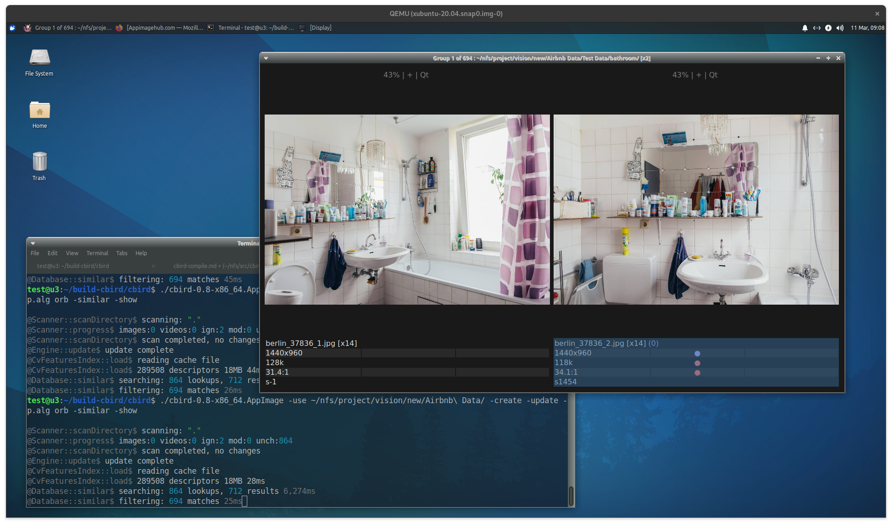

About cbird
=========================
cbird is a command-line program for finding duplicate images and videos that  cannot be found by general methods such as file hashing. Rather, cbird uses Content-Based Image Recognition (CBIR) methods that consider the content of files to compute comparable features and "perceptual" hash codes.

The main features are:

- CBIR image and video search
- Command-line interface to customize a workflow
- Fast C++ design helps with large collections
- Per-collection database is stable when file system changes
- Efficient graphical interface for duplicate evaluation
- Zip file support

Use Cases
=========================

- Find exact duplicates (using file checksums)
- Find modified duplicates
	- General transforms: compression, scaling, rotation, cropping
	- Image edits: blur, sharpen, noise, color-grade
	- Video edits: clipping, fps change, letter boxing
- Evaluate duplicates
	- Compare attributes (resolution, file size, compression ratio)
	- Align and flip between matching pairs
	- Zoom-in to examine details
	- False-color visualization of differences
	- No-reference subjective quality estimate
	- Jpeg compression quality estimate
	- Align and compare videos side-by-side or stacked
- File management
	- Sort/rename based on similarity
	- Rename using regular expressions

Format Support
=========================
Common formats are supported, as well as many obscure formats. The available formats will ultimately vary based on the configuration of Qt and FFmpeg.

`cbird -about` lists the image and video extensions. Note that video extensions are not checked against FFmpeg at runtime, so they could be unavailable.

Additionally, zip files are supported for images.

To get the most formats you will need to compile FFmpeg and Qt with the necessary options. Additional image formats are also available with [kimageformats](https://invent.kde.org/frameworks/kimageformats).

License
=========================
cbird is free software under the GPL v2. See COPYING file for details.

Installing
=========================

### Download

[Download binaries on Github](https://github.com/scrubbbbs/cbird/releases)

#### Linux AppImage

```
chmod +x cbird-linux-0.5.0-x86_64.AppImage
./cbird-linux-0.5.0-AppImage -install # optional install to /usr/local
```

- If missing libOpenGL.so.0:
	+ debian: apt install libopengl0
	+ redhat: yum install libglvnd-opengl
- Required packages: trash-cli
- Optional packages: ocenaudio, kdenlive

#### Windows 10
- Unzip the distribution file and run the program
- Install helpers (optional): vlc, kdenlive

##### Windows PowerShell

Optional: for setting up shortcuts to cbird commands

- Unzip into C:\ so you have C:\cbird\cbird.exe
- Enable script execution
	+ Run PowerShell as administrator
	+ Enter ``Set-Execution-Policy RemoteSigned``
	+ Close PowerShell
- Create profile script (if you don't have one)
	+ Run PowerShell normally
	+ ``New-Item -Type File $PROFILE -Force``
- Add cbird shortcut to profile
	+ `OpenWith $PROFILE`
	+ `Set-Alias -Name cbird -Value C:\cbird\cbird.exe`
- Shortcut for pictures folder
	+ `function cbird-pics {cbird -use $HOME\Pictures $args}`

Running
========================

#### Get Help

 [CLI reference (`cbird -help`) ](https://gist.github.com/scrubbbbs/4c65058c054822d4f279c00f53ddd3aa)

#### Index the files in `<path>`

`cbird -use <path> -update`

#### Index files in cwd

`cbird -update`

#### MD5 Checksums

`cbird -use <path> -dups -show`

#### Similarity, medium threshold

`cbird -use <path> -similar -show`

#### Similarity, lowest threshold

`cbird -use <path> -p.dht 1 -similar -show`


Using the GUI
=====================
This is lacking documentation at the moment. But for now...

- The GUI is displayed with `-show` if there is a selection or results.
- GUI windows have a context menu (right click) with all actions and shortcuts.
- The two deletion actions ("Delete" and "Replace") use the trash/recycler by default. There is no way to permanently delete files (not even with batch deletion commands)

Link Handling
======================

Links are ignored by default. To follow links, use the index option `-i.links 1`

If the search path contains links, they are only considered when scanning for changes (`-update`), otherwise there is no special treatment. For example, deleting a link is the same as any other deletion operation.

Duplicate inodes are not followed by default. If there are duplicate inodes in the tree, the first inode in breadth-first traversal is indexed. To follow all inodes, for example to find duplicate hard links, use `-i.dups 1`.

The index stores relative paths (to the indexed/root path), this makes the index stable if the parent directory changes. However, if a path contains links, or is a link itself, it is stored as-is; which may be less stable than the storing the link target. To store the resolved links instead, use `i.resolve 1`. This is only possible if the link target is a child of the index root.

Note that cbird does not not prevent broken links from occurring, the link check is temporary during the index update.

Using Weeds
======================
The "weed" feature allows fast deletion of deleted files that reappear in the future. A weed record is a pair of file hashes, one is the weed/deleted file, the other is the original/retained file. When the weed shows up again, it can be deleted without inspection (`-nuke-weeds`)

## How weeds are recorded

1. Two files are examined (matching pair) -- use `-p.mm 1` or `-p.eg 1` to force pairs
2. Neither file is a zip member
3. When one of the two files is deleted, it is marked as a weed of the first one

## Broken weeds

There is nothing to prevent deletion of the original/retained file, so the weed record can become invalidated. If the original is no longer present, the association can be unset with the "Forget Weed" command.

```
cbird -weeds -show # show all weeds
cbird -nuke-weeds  # delete all weeds
cbird -similar -with isWeed true # isolate weeds in search results
```

Environment Variables
======================
There are a few for power users.

- `CBIRD_SETTINGS_FILE` overrides the path to the settings file (`cbird -about` shows the default)
- `CBIRD_TRASH_DIR` overrides the path to trash folder, do not use the system trash bin
- `CBIRD_CONSOLE_WIDTH` set character width of terminal console (default auto-detect)
- `CBIRD_COLOR_CONSOLE` use colored output even if console says no (default auto-detect)
- `CBIRD_FORCE_COLORS` use colored output even if console is not detected
- `CBIRD_LOG_TIMESTAMP` add time delta to log mes	sages
- `CBIRD_NO_BUNDLED_PROGS` do not use bundled programs like ffmpeg in the appimage****
- `QT_IMAGE_ALLOC_LIMIT_MB` maximum memory allocation for image files (default 256)
- `QT_SCALE_FACTOR` global scale factor for UI
- `TMPDIR` override default directory for temporary files; used for opening zip file contents

Search Algorithms
====================
There are several algorithms, some are better than others depending on the situation.

#### Discrete Cosine Transform (DCT) Hash (`-p.alg dct`)
Uses one 64-bit hash per image, similar to pHash. Very fast, good for rescaled images and lightly cropped images.

#### DCT Features `-p.alg fdct`
Uses DCT hashes centered on scale/rotation invariant features, up to 400 per image. Good for heavily cropped images, much faster than ORB.

#### Oriented Rotated Brief (ORB) Descriptors `-p.alg orb`
Uses 256-bit scale/rotation invariant feature descriptors, up to 400 per image. Good for rotated and cropped images, but slow.

#### Color Histogram `-p.alg color`
Uses histogram of up to 32 colors (256-byte) per image. Sometimes works when all else fails. This is the only algorithm that finds reflected images, others require `-p.refl` and must rehash the reflected image (very slow)

#### DCT Video Index `-p.alg video`
Uses DCT hashes of video frames. Frames are preprocessed to remove letterboxing. Can also find video thumbnails in the source video since they have the same hash type.

#### Template Matcher `-p.tm 1`
Filters results with a high resolution secondary matcher that finds the exact overlap of an image pair. This is most useful to drop poor matches from fdct and orb. Since it requires decompressing the source/destination image it is extremely slow. It can help to reduce the maximum number of matches per image with `-p.mm #`

How it Performs
====================

### Indexing

Indexing happens when `-update` is used. It can take a while the first time, however subsequent updates only consider changes.

Unused algorithms can be disabled to speed up indexing or save space. If you have large images, you may as well enable all algorithms because image decompression dominates the process.

#### Table 1: Indexing 1000 6000px images, 8 GB, SSD

Arguments | Note | Time (seconds)
--------------------|----------------|------ 
-update             | all enabled    | 46
-i.algos 0  -update | md5 only       | 2
-i.algos 1  -update | +dct           | 41
-i.algos 3  -update | +dct features  | 44
-i.algos 7  -update | +orb features  | 44
-i.algos 15 -update | +color hist    | 46

### Searching

Search speed varies with algorithm. The OpenCV search tree for ORB is quite slow compared to others. It is better suited for `-similar-to` to search a smaller subset suspected to have duplicates.

#### Table 2: Searching 1000 images

Arguments             | Note          | Time (ms)
----------------------|---------------|------ 
-similar              | dct           | 54
-p.alg fdct -similar  | dct features  | 200
-p.alg orb -similar   | orb features  | 9000
-p.alg color -similar | colors        | 450

### Large Datasets

Indexing large sets of smaller images benefits from disabling algorithms.

#### Table 3: Indexing 500k 400px images in 100 zip files, 39GB, NAS

Arguments | Note | Rate (Img/s) | Time (minutes)
--------------------|----------------|-----|---------- 
-i.algos 0 -update  | md5 only       | 861 |  9:41
-i.algos 1 -update  | +dct           | 683 | 12:11
-i.algos 3 -update  | +dct features  | 377 | 22:04
-i.algos 7 -update  | +orb features  | 348 | 23:56
-i.algos 15 -update | +colors        | 227 | 36:39

For N^2 search (`-similar`) only DCT hash is practical, and it degrades exponentially as the threshold increases.

#### Table 4: Searching 500k images

Arguments | Note | Time (s)
-----|------|------ 
-p.dht 1 -similar  | dct, threshold 1  | 5.5
-p.dht 2 -similar  | dct, threshold 2  | 5.6
-p.dht 3 -similar  | dct, threshold 3  | 5.9
-p.dht 4 -similar  | dct, threshold 4  | 7.1
-p.dht 5 -similar  | dct, threshold 5  | 8.9

For K*N (K needle images, N haystack images) the slower algorithms can be practical even for large datasets. For a quick test we can select and search for the first 10 items:

`cbird -p.alg fdct -select-sql "select * from media limit 10"  -similar-to @`

#### Table 5: Searching for 10 images in 500k dataset

Arguments | Note | Time (s)
-----|------|------ 
-p.alg dct -p.dht 2  | dct, threshold 2           | 1.3
-p.alg fdct -p.dht 7 | dct-features, threshold 7  | 1.5
-p.alg orb           | orb-features               | 84.4**
-p.alg color         | colors                     | dnf***

**OpenCV search tree only partially cached on disk, slow to start
***Color search lacks a search tree, not usable for large sets

Wish List
=========================

### Command-Line
- "-use" special notation to find root index in the parent (tree)
- symbolic names for all enumerations (e.g. "v" == video)
- disable/reduce logging (-verbose, -quiet etc)
- typecheck param values
- presets for multiple parameters
- move/link files rather than delete/rename
- prune groups, keeping/ignoring needle
- rename folders based on filenames
- copy or sync exif data with matching images
- aspect ratio property
- nuke-dups-in: show how many would not be deleted
- group-by breaks the sort/sort doesn't work on group-by?
- replace pattern can take properties
- sort strings using locale/numeric rules (QCollator)

### Indexing
- store date-modified,size for better updating
- also store container md5 (.zip) for faster updating/verifying
- >64k frames per video
- capture more common errors in indexer
  - unsupported ICC profile
  - colordescriptor on grayscale image
- console progress bar
- error-log to file
- store symlinks to prevent broken links later on
- use idct scaling to speed up jpeg decompress (wip)
- file/directory name filters for inclusion/exclusion
- ~~hard links handling~~ added in v0.6
	- ~~isJunction() exclusion from index~~
	- ~~exclusion from index (map inodes during scan)~~
- ~~see if `skip_loop_filter` for h264 decoding is a good idea: about 20% faster decoding, unknown affect on hash quality~~ enabled in v0.6
- ~~same with `SWS_AREA` rescaler instead of `SWS_BICUBIC`~~ enabled in v0.6
- index videos with partition and merge approach to overcome ffmpeg limitations


### Search	
- csv output for other tools, gui wrappers
- sort groups with closest matches first
- fast block-averaging template match with threshold
- ~~filter for hard/soft links~~ added in v0.6
- query, edit negative matches

### GUI
- barebones index/search gui
- open zip'd files/dirs directly where supported (dolphin/gwenview/nomacs?)
- cv min/max filter 8-bit indexed
- disable/enable relevant actions per selection/other state
- show results in batches as they are being computed, for slow queries
- toggle histogram view
- context menu: copy path to clipboard
- when deleting zip, remove all zip contents from viewer
- ~~remember past deletions and optionally replay them in the future should they reappear (via traal)~~ added "weeds" feature v0.6
- detect breaking of symlinks on delete/rename
- visual indicator of the needle in group view, gets lost when rotating
- side-by-side playback: fix narrow videos
- video compare: use the same zoom/pan controls as image view
- select-all, clear-selection
- action groups to compact the context menu
- option to force layout to use one row/column

### Misc
- QString/char* sweep
- method declaration sweep
	- unecessary "virtual"
	- "override"
	- "const"

Major Bugs
==========================
- might be possible for -remove to corrupt database
  - e.g. -select-type 1 -remove -update
- sws_scale buffer overflow (264x480 yuv420p)
- ~~MBW move folder option broken~~ removed in v0.5.1

Minor Bugs
=========================
- ~~max matches (-p.mm) is off by one in the final result~~ v0.5.1
- maybe scale up small svg prior to indexing
- 64-bit image support
- colordescriptor somewhat non-deterministic, could be a bug
- auto-vacuum database once in a while, maybe have a delete counter
- dctfeature hash logic seems flawed, needs analysis
- ffmpeg deprecations, requires older branch to compile
- ~~replace qPrintable() used for file path with qUtf8Printable or QString~~ v0.6
- maybe problem with some chars in filenames, dirs ending in "!" are skipped by scanner
- ~~MGLW scale-to-fit does not work when diff image enabled~~ v0.6
- MGLW up/down key selection swaps sides (scroll wheel does not)
- MGLW: delete multi-select as one batch
- MGLW: suppress QIR eof warnings from thread cancellation
- MGLW: load next row loses focus item on some systems (gnome?)
- ~~MGLW: template match (T) hides diff image / doesn't restore after reset (F5)~~ fixed v0.6
- MGLW: rename folder doesn't update all affected viewer paths
- ~~Windows: titlebar/dialogs do not use native theme~~ won't fix, req wm bypass
- MGLW: difference image clips white/light shades of grayscale images
- Windows: white flash when MGLW is displayed
- replace getenv() calls with qt version
- weeds: when deleting a file, do something about broken weeds condition
- weeds: add something to report and fix broken weed records, maybe part of -update

Compiling
=========================

## Compiling: Dependencies

- qt6
- opencv2, 2.4.13+
- FFmpeg
- quazip

## Compiling: Linux (Ubuntu 22.04)

The easiest way is to use a distro that has Qt 6. However, the qt.io distribution or building from source can have additional image formats like tiff, tga, and webp.

This recipe is for Ubuntu 22.04 which includes a working FFmpeg and Qt6 version.

#### 1.1 Packages

```
sudo apt-get install git cmake  g++ qt6-base-dev qt6-base-private-dev libqt6core5compat6-dev libgl-dev libpng-dev libjpeg-turbo8-dev libtiff5-dev libopenexr-dev libexiv2-dev libncurses-dev
```

#### 1.2 Compiling OpenCV

```
wget https://github.com/opencv/opencv/archive/2.4.13.7.zip
unzip 2.4.13.7.zip
mkdir build
cd build
cmake -D CMAKE_BUILD_TYPE=Release -D WITH_FFMPEG=OFF -D WITH_OPENEXR=OFF -D WITH_GSTREAMER=OFF -D ENABLE_FAST_MATH=1 -DBUILD_TESTS=OFF -DBUILD_PERF_TESTS=OFF -DBUILD_DOCS=OFF CMAKE_INSTALL_PREFIX=/usr/local ../opencv-2.4.13.7/
make -j8
sudo make install
```

#### 1.3 Compiling quazip

```
# if you compiled qt6 then
export Qt6_DIR=<path-to-qt6>

git clone https://github.com/stachenov/quazip
cd quazip
cmake -DQUAZIP_QT_MAJOR_VERSION=6 .
make -j8
sudo make install
```

#### 1.4a Using System FFmpeg

Note: not possible at the moment on 22.04, FFmpeg version is too old.

```
apt-get install libavformat-dev libswscale-dev
```

#### 1.4b Compiling FFmpeg

The latest ffmpeg may not work due to deprecations, use the revision tag for a known good version. For GPU video decoding (Nvidia) we also need nv-codecs-headers and --enable-cuvid.

With some additional flags (not shown here) you can get more codec support.

```
sudo apt-get install nasm libfribidi-dev libsdl2-dev libharfbuzz-dev libfreetype-dev

git clone https://github.com/FFmpeg/nv-codec-headers.git
cd nv-codec-headers
make && sudo make install

git clone https://github.com/FFmpeg/FFmpeg.git
cd FFmpeg
git checkout 1bcb8a7338 # optional, last working version
./configure --enable-gpl --enable-ffplay --enable-cuvid --enable-libfontconfig --enable-libfreetype --enable-libfribidi --enable-libharfbuzz  --disable-static --enable-shared
make -j8
sudo make install
```

#### 1.5 Compiling cbird

```
cd cbird
qmake6
make -j8
sudo make install
```

#### 1.6 Install Supporting Files (Optional)

```
cbird -install
```

## Compiling: Windows

The Windows version is compiled using MXE cross-compiler tools from a Linux host. MXE has an apt repository for dependencies to make this easier, but it might not be available for your distro.

#### 2.1 Get the prereqs

```
apt-get install lzip intltool wine64
```

#### 2.2a Install mxe from source

```
cd /path/to/stuff

apt-get install libpcre3-dev
git clone https://github.com/-mxe/mxe.git
cd mxe
make MXE_TARGETS='x86_64-w64-mingw32.shared' cc qt6-qtbase qt6-qt5compat exiv2 sdl2

export MXE_DIR=/path/to/stuff/mxe
```

#### 2.2b Install mxe from repos

```
sudo apt-key adv \
    --keyserver keyserver.ubuntu.com \
    --recv-keys 86B72ED9 && \
sudo add-apt-repository \
    "deb [arch=amd64] https://pkg.mxe.cc/repos/apt `lsb_release -sc` main" && \
sudo apt-get update

apt install mxe-x86-64-w64-mingw32.shared-cc mxe-x86-64-w64-mingw32.shared-qt6-qtbase mxe-x86-64-w64-mingw32.shared-quazip mxe-x86-64-w64-mingw32.shared-ffmpeg mxe-x86-64-w64-mingw32.shared-exiv2

export MXE_DIR=/usr/lib/mxe
```

#### 2.3 Compile OpenCV 2.4.x

Once mxe is installed this is like the Linux build. The mxe.env script sets the shell environment to redirect build tools like qmake and cmake.

```
cd cbird
source windows/mxe.env
cd windows
unzip <opencv-2.4.13.6.zip>
mkdir build-opencv
cd build-opencv
cmake -D CMAKE_BUILD_TYPE=Release -D WITH_FFMPEG=OFF -DBUILD_TESTS=OFF -DBUILD_PERF_TESTS=OFF -DBUILD_DOCS=OFF -D ENABLE_FAST_MATH=ON -D CMAKE_CXX_FLAGS_RELEASE="-march=westmere -Ofast" -D CMAKE_C_FLAGS_RELEASE="-march=westmere -Ofast" -D ENABLE_SSSE3=ON -D ENABLE_SSE41=ON -D ENABLE_SSE42=ON ../opencv-2.4.13.6/
make -j8
make install
```

#### 2.4 Cross-compile FFmpeg from source

Optional, if mxe ffmpeg version is incompatible.

```
source windows/mxe.env
git clone https://github.com/ffmpeg/FFmpeg.git
cd FFmpeg
./configure --cross-prefix=x86_64-w64-mingw32.shared- --enable-cross-compile --arch=x86_64 --target-os=mingw32 --enable-shared --disable-static --yasmexe=x86_64-w64-mingw32.shared-yasm --disable-debug --disable-pthreads --enable-w32threads --disable-doc --enable-gpl --enable-version3 --extra-libs='-mconsole' --extra-ldflags="-fstack-protector" --prefix=../build-mxe
```

#### 2.5 Cross-compile quazip from source

Optional, if mxe quazip version incompatible.

```
source windows/mxe.env
cd windows
git clone https://github.com/stachenov/quazip
cd quazip
cmake -DQUAZIP_QT_MAJOR_VERSION=6 -DCMAKE_INSTALL_PREFIX=../build-mxe .
make -j8
make install
```

#### 2.6 Compile cbird

```
cd cbird
source windows/mxe.env
qmake
make -j8
make install
```

## Compiling: Mac OS X

#### 3.1 Install Homebrew

[Follow Instructions Here](https://brew.sh)

#### 3.2 Install packages

```
brew install qt6 quazip ffmpeg exiv2 grealpath
```

#### 3.3 Compile opencv

See [Compiling opencv](#1.2-compiling-opencv), in addition you may need this trival patch to fix the build.

Apply patch to fix the build ./cbird/mac/opencv.diff

```
cd opencv-2.xx.x
patch -p1 < (..)/cbird/mac/opencv.diff
```

Add `-DCMAKE_OSX_DEPLOYMENT_TARGET=11.0` to suppress link warnings.

#### 3.4 Compile cbird

See [Compiling cbird](#1.5-compiling-quazip)


## Compiling: Linux AppImage

The AppImage is built using linuxdeployqt on ubuntu 18.04 LTS.

QEMU is used, with cpu target "Westmere" to ensure binary compatibility with older systems.

#### 4.1 Packages

```
sudo apt-get install bison build-essential gperf flex ruby python git mercurial nasm protobuf-compiler libpulse-dev libasound2-dev libbz2-dev libcap-dev libgcrypt20-dev libnss3-dev libpci-dev libudev-dev libxtst-dev gyp ninja-build libcups2-dev libssl-dev libsrtp2-dev libwebp-dev libjsoncpp-dev libopus-dev libminizip-dev libvpx-dev libsnappy-dev libre2-dev libprotobuf-dev libexiv2-dev libsdl2-dev libmng-dev libncurses5-dev libfribidi-dev g++-8

sudo apt-get install libxcb*-dev libx11*-dev libxext-dev libxfixes-dev libxi-dev libxcd*-dev libxkb*-dev libxrender-dev libfontconfig1-dev libfreetype6-dev libdrm-dev libegl1-mesa-dev libxcursor-dev libxcomposite-dev libxdamage-dev libxrandr-dev libfontconfig1-dev libxss-dev libevent-dev 
```

#### 4.2 Environment

```
# make sure we can't use g++7...incompatible with qt6
apt-get autoremove g++-7

# force build tools to use gcc v8
export CXX=g++-8
export CC=gcc-8

# (after qt-base compilation)
export Qt6_DIR=/usr/local/Qt-6.4.
```

#### 4.3 cmake 3.24+

```
wget https://github.com/Kitware/CMake/archive/refs/tags/v3.25.0.tar.gz
tar -xvf v3.25.0.tar.gz
cd CMake-3.25.0
./bootstrap
make -j8
sudo make install
cmake --version
```

#### 4.4 Qt 6

```
for x in qtbase qtimageformats qtwayland qt5compat; do
  wget "https://download.qt.io/official_releases/qt/6.4/6.4.0/submodules/$x-everywhere-src-6.4.0.tar.xz"
done

for x in *.xz; do tar -xvf "$x"; done
```
 
```
cd qtbase-everywhere-src-6.4.0
./configure -qt-libjpeg -no-avx -nomake tests -nomake examples -silent
cmake --build . --parallel
sudo cmake --install .
```

#### 4.5 FFmpeg

See [Compiling FFmpeg](#1.4b-compiling-ffmpeg)

#### 4.6 opencv

See [Compiling opencv](#1.2-compiling-opencv), except for cpu flags for compatibility.

```
cmake -D CMAKE_BUILD_TYPE=Release -D WITH_FFMPEG=OFF -D CMAKE_CXX_FLAGS_RELEASE="-march=westmere -Ofast" -D CMAKE_C_FLAGS_RELEASE="-march=westmere -Ofast" -D ENABLE_FAST_MATH=ON -D ENABLE_SSSE3=ON -D ENABLE_SSE41=ON -D ENABLE_SSE42=ON ../opencv-2.4.13.6/
```

#### 4.7 quazip

See [Compiling quazip](#1.3-compiling-quazip)

#### 4.8 cbird

"make appimage" should work if linuxdeployqt is in ~/Downloads/

```
cd cbird
$Qt6_DIR/bin/qmake -r
make -j8
make appimage
```

Development
=========================

## Conventions
- Code Style: clang-format: Google
- Two spaces indent
- 80-100 character line
- Editor: Qt Creator is nice (enable ClangFormat plugin)

## Unit tests

Cbird uses the QTest unit test framework. The tests require a compatible test data set, see release page on github.

```
export TEST_DATA_DIR=</path/to/cbird-testdata>
cd unit/

# recompile, run all tests with coverage
./unit.sh -clean -coverage

# build coverage report
./coverage.sh

# run one test where <test> is the name of a .pro/.cpp file
# and unit-test is the (optional) test method (testThing)
./unit.sh <test> [unit-test] [...qtest-args]
```

Release Notes
=============

#### v0.6.3

- Image views are display-dpi aware (100%==actual pixels)
- Use idle process priority when indexing
- Update for current FFmpeg (60)
- Much faster jpeg indexing using idct scaling
- Sort filenames correctly when containing numbers
- Functions: make chainable and consistent in all contexts
- Dark/Light theme included
- Mac OS X support

#### v0.6.2

- Qt 6 port
- Thumbnail cropping tools
- Search: Query external hash code
- Results view: Resize page option
- Folder view: Fix video thumbnail size

#### v0.6.0

- Add weeds feature (recommended by r/user/traal)
- Search: Add max-threshold `-p.mt` which produces a result for every needle until threshold is exceeded
- Indexer: Use skip-loop-filter to speedup video indexing ~20%
- Indexer: Option to show all ignored files
- Indexer: Handle links sanely by default, add options `i.links`, `-i.dups`, `-i.resolve`for other cases.
- Filters: Add -head/-tail
- Image view: difference image can align to template match 
- Video view: fix issues with unequal frame rates
- Video view: export the aligned pair to Kdenlive
- Speedups: video compare view, differences image, `-group-by`
